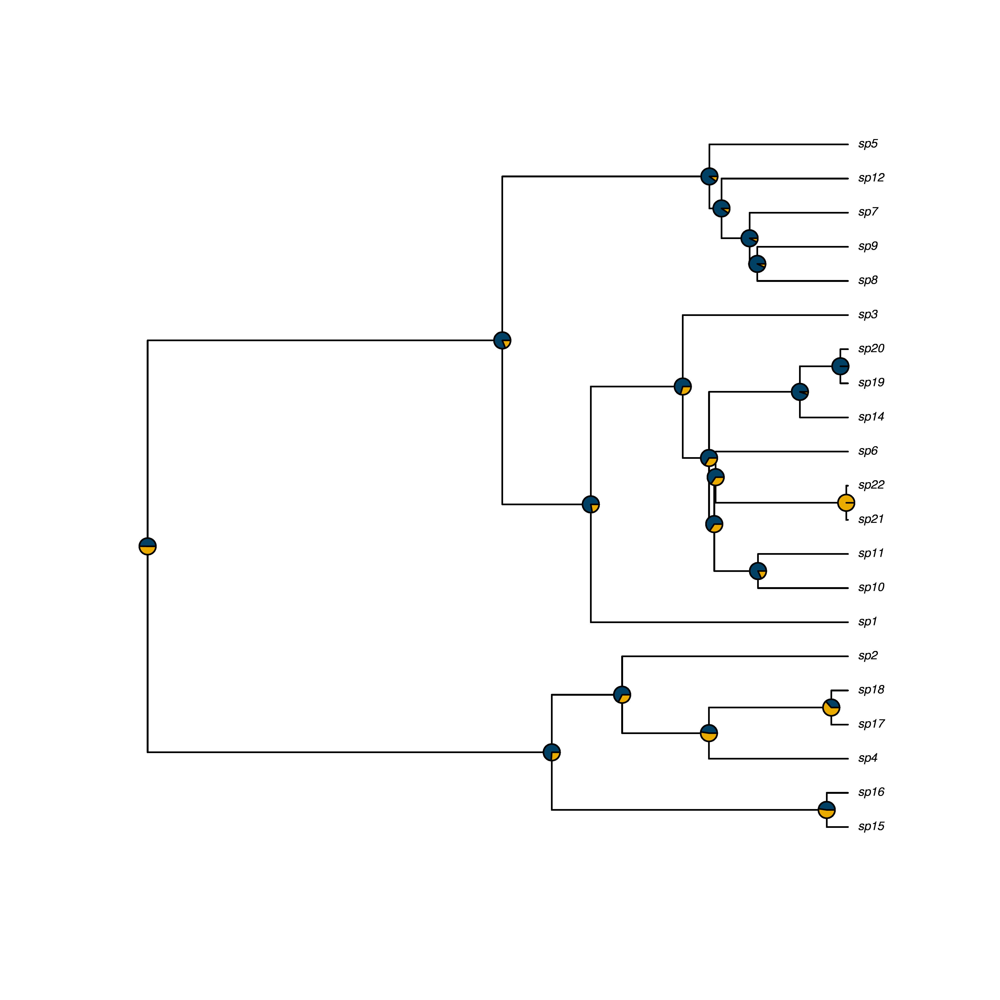

# Validating RevBayes joint ancestral state estimation

This repo contains scripts to validate the joint ancestral state
estimation of SSE models implemented in [RevBayes](http://revbayes.com)
against the marginal ancestral state
estimation implemented in the R package [diversitree](http://www.zoology.ubc.ca/prog/diversitree/).

### To run an example:

First simulate a tree and character under BiSSE using diversitree. This script will also estimate 
and plot marginal ancestral states using diversitree:

```
Rscript 1_simulate_BiSSE.R
```

Now estimate joint ancestral states using RevBayes:

```
rb 2_validate.Rev
```

And make a plot of the RevBayes results:

```
Rscript 3_plot_Rev_results.R
```

And now let's make a plot to compare the posterior probabilties estimated
in RevBayes to those estimated in diversitree:

```
Rscript 4_plot_node_probs.R
```

### Example results:

Here we show the results for an example where λ0 = 0.2, λ1 = 0.4, µ0 = 0.01, µ1 = 0.1, 
and q01 = q10 = 0.1.

The log-likelihood as computed by diversitree was -109.4591,
whereas with RevBayes it was -109.71.
Small differences in the log-likelihoods are expected due to differences
in the way diversitree and RevBayes calculates probabilities at the root,
and also due to numerical approximations.
However the joint and marginal reconstructions should return the same probabilities 
for ancestral states at the root, and indeed
diversitree calculated the root probability of being in state 0 as 0.555
and RevBayes calculated it as 0.554. From a plot comparing
the posterior probabilities for all nodes estimated in RevBayes to those
estimated in diversitree we can see that all the estimates are very close:


### diversitree ancestral states:



### RevBayes ancestral states:


