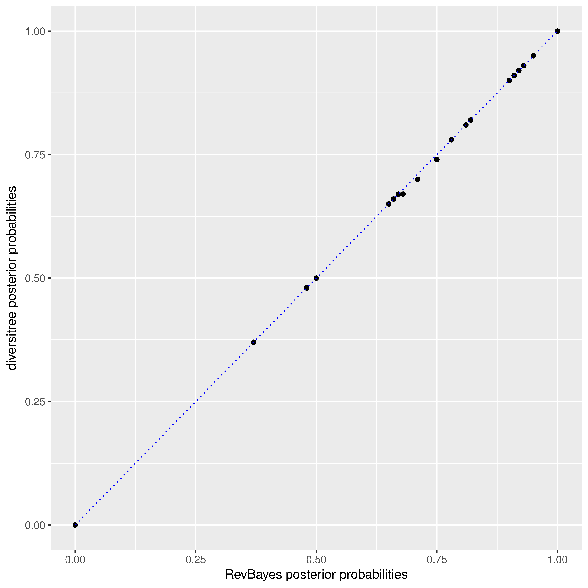

# Validating RevBayes joint ancestral state estimation

This code repository 
contains scripts to validate the Monte Carlo method of
ancestral state estimation for SSE models
implemented in [RevBayes](http://revbayes.com) against the
analytical marginal ancestral state estimation
implemented in the R package [diversitree](http://www.zoology.ubc.ca/prog/diversitree/).

Although the closest model to ChromoSSE implemented in diversitree
is ClaSSE, ancestral state estimation for ClaSSE is not implemented in diversitree.
Therefore here we compare the ancestral state estimation of BiSSE as implemented
in diversitree to the estimates made by RevBayes. Note that in RevBayes BiSSE,
ChromoSSE, and all other SSE models use the same C++ classes and algorithms,
so validating ancestral state estimation for BiSSE should provide confidence
in estimates made by all SSE models.

In RevBayes we sample ancestral states for SSE models
from their joint distribution
conditional on the tip states and the model parameters during the MCMC.
However, in this work we summarize the MCMC samples by calculating the
marginal posterior probability of each node being in each state.
So the RevBayes marginal ancestral state reconstructions which are
estimated via MCMC are directly comparable to the
analytical marginal ancestral states computed by diversitree.
It would be possible to summarize the samples from the MCMC
to reconstruct the MAP joint ancestral state reconstruction,
but we have not done so in this work.


### To run an example:

First simulate a tree and character under BiSSE using diversitree. This script will also estimate 
and plot marginal ancestral states using diversitree:

```
Rscript 1_simulate_BiSSE.R
```

Now estimate ancestral states using RevBayes and summarize the marginal ancestral states:

```
rb 2_validate.Rev
```

And make a plot of the RevBayes results:

```
Rscript 3_plot_Rev_results.R
```

And now let's make a plot to compare the posterior probabilties estimated
in RevBayes to those estimated in diversitree:

```
Rscript 4_plot_node_probs.R
```

### Example results:

Here we show ancestral state estimates under BiSSE for an example where
the tree and tip data were simulated in diversitree with the following parameters:
λ0 = 0.2, λ1 = 0.4, µ0 = 0.01, µ1 = 0.1, 
and q01 = q10 = 0.1.

The log-likelihood as computed by diversitree was -109.4591,
whereas with RevBayes it was -109.71.
Small differences in the log-likelihoods are expected due to differences
in the way diversitree and RevBayes calculate probabilities at the root,
and also due to numerical approximations.
However both reconstructions should return the same probabilities 
for ancestral states at the root, and indeed
diversitree calculated the root probability of being in state 0 as 0.555
and RevBayes calculated it as 0.554. 
The estimated posterior probabilities are very close for all nodes.
This is shown in a plot comparing
the marginal posterior probabilities for all nodes being in state 1 
as estimated by RevBayes against the diversitree estimates:

<p align="center">

</p>

### diversitree ancestral states:

<p align="center">

</p>

### RevBayes ancestral states:


